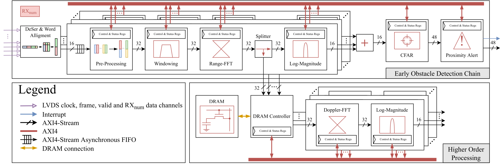

# SpaceFFT

Signal Processing ACcElerator For Fast Target detection (SPACEFFT detection)

## Overview

This repository contains a  radar signal processing architecture for early detection of automotive obstacles that does
not impede subsequent higher order processing. Proposed
architecture was designed using agile digital design
methodology and it is written in [Chisel](www.chisel-lang.org) hardware design language. This architecture is suitable for interfacing with different types of automotive radar front-ends. It supports a collection of pipelined [FFT](https://github.com/milovanovic/sdf-fft) processors with plethora of
parameterization options and multiple different variants of [CFAR](https://github.com/milovanovic/cfar)
algorithm.



## Prerequisites

The following software packages should be installed prior to running this project:

* [sbt](http://www.scala-sbt.org)
* [Verilator](http://www.veripool.org/wiki/verilator)

## Setup

Clone this repository, switch directory and run tests:

```bash
git clone https://github.com/milovanovic/SpaceFFT.git
cd SpaceFFT
git submodule update --init --recursive
```

## Generate verilog

To generate verilog code run:

```bash
make SpaceFFT
```

Verilog code will be generated in folder:

* `verilog/SpaceFFT`
